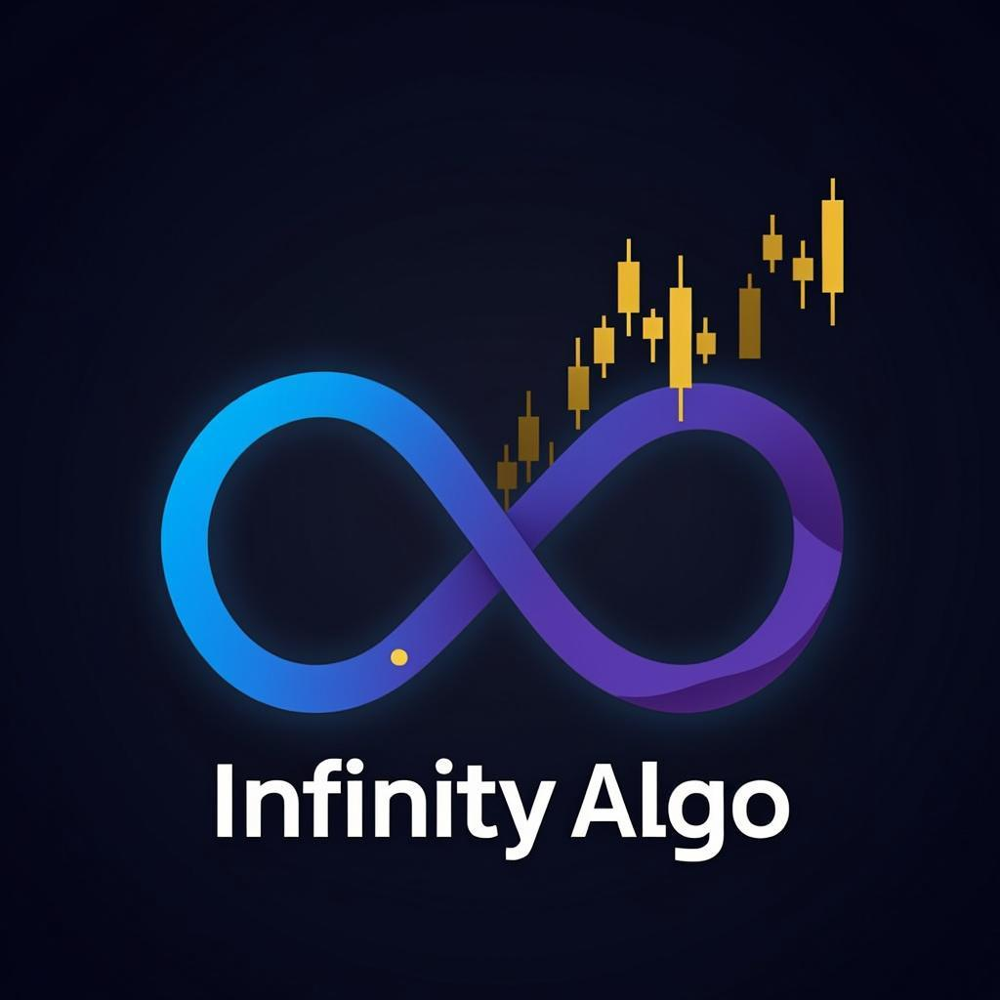

# Infinity Algo by Jeremy

<div align="center">
  
  
  **World-Class AI Trading Platform**
  
  [](https://nextjs.org/)
  [](https://www.typescriptlang.org/)
  [](https://tailwindcss.com/)
  [](LICENSE)
</div>

---

## 🚀 Overview

**Infinity Algo by Jeremy** is a professional SaaS trading platform designed for modern traders. It combines advanced charting, AI-powered analysis, comprehensive calculators, and educational resources into one seamless experience.

### ✨ Key Features

- **📊 Advanced Charts** - TradingView-style charting with multiple timeframes, indicators, and drawing tools
- **🤖 AI Trading Assistant** - Intelligent trade analysis, risk assessment, and market bias detection
- **🧮 20+ Trading Calculators** - Professional calculators for position sizing, risk management, and analysis
- **📝 Trade Journal** - Track, analyze, and improve your trading performance
- **🎓 Academy Integration** - Seamless connection to [Infinity Algo Academy](https://infinityalgoacademy.net)
- **🔐 User System** - Authentication, portfolio tracking, and subscription management

---

## 🛠️ Tech Stack

| Category | Technology |
|----------|------------|
| **Frontend** | Next.js 15, React 19, TypeScript |
| **Styling** | Tailwind CSS, Shadcn UI |
| **Animations** | Framer Motion |
| **Charts** | Lightweight Charts, Recharts |
| **Icons** | Lucide React |
| **Forms** | React Hook Form, Zod |
| **Backend** | Next.js API Routes |
| **Database** | Supabase (PostgreSQL) |
| **AI** | z-ai-web-dev-sdk (LLM Integration) |
| **Deployment** | Vercel |

---

## 📦 Installation

### Prerequisites

- Node.js 18+ 
- Bun or npm
- Supabase account
- Git

### Quick Start

```bash
# Clone the repository
git clone https://github.com/yourusername/infinity-algo.git
cd infinity-algo

# Install dependencies
bun install

# Copy environment variables
cp .env.example .env.local

# Start development server
bun run dev
```

Open [http://localhost:3000](http://localhost:3000) in your browser.

---

## ⚙️ Configuration

### Environment Variables

Create a `.env.local` file with the following variables:

```env
# Supabase Configuration
NEXT_PUBLIC_SUPABASE_URL=your_supabase_url
NEXT_PUBLIC_SUPABASE_ANON_KEY=your_supabase_anon_key
SUPABASE_SERVICE_ROLE_KEY=your_service_role_key

# AI Configuration (z-ai-web-dev-sdk)
ZAI_API_KEY=your_zai_api_key

# Application
NEXT_PUBLIC_APP_URL=http://localhost:3000
NEXT_PUBLIC_APP_NAME=Infinity Algo

# Optional: Analytics
NEXT_PUBLIC_GA_ID=your_google_analytics_id
```

### Supabase Setup

1. Create a new Supabase project at [supabase.com](https://supabase.com)
2. Run the SQL migrations in `supabase/migrations/`
3. Enable Row Level Security (RLS)
4. Configure authentication providers

---

## 📁 Project Structure

```
infinity-algo/
├── src/
│   ├── app/                    # Next.js App Router
│   │   ├── page.tsx           # Main SPA page
│   │   ├── layout.tsx         # Root layout
│   │   ├── globals.css        # Global styles
│   │   └── api/               # API routes
│   │       ├── ai-assistant/  # AI chat endpoint
│   │       ├── trades/        # Trade journal API
│   │       └── calculators/   # Calculator APIs
│   ├── components/
│   │   ├── ui/                # Shadcn UI components
│   │   ├── layout/            # Header, Footer, Sidebar
│   │   ├── dashboard/         # Dashboard widgets
│   │   ├── charts/            # Trading charts
│   │   ├── ai/                # AI assistant components
│   │   ├── calculators/       # Calculator components
│   │   ├── journal/           # Trade journal components
│   │   └── academy/           # Academy promotion
│   ├── lib/
│   │   ├── utils.ts           # Utility functions
│   │   ├── calculations.ts    # Calculator logic
│   │   └── db.ts              # Database client
│   ├── hooks/                 # Custom React hooks
│   └── types/                 # TypeScript types
├── public/
│   ├── logo.png               # Platform logo
│   ├── favicon.ico            # Favicon
│   └── images/                # Static images
├── .env.example               # Environment template
├── next.config.ts             # Next.js configuration
├── tailwind.config.ts         # Tailwind configuration
├── components.json            # Shadcn configuration
└── README.md                  # This file
```

---

## 🧮 Available Calculators

### Position & Risk Management
1. **Position Size Calculator** - Calculate optimal position size based on risk percentage
2. **Risk/Reward Calculator** - Evaluate potential profit vs. risk
3. **Lot Size Calculator** - Determine appropriate lot sizes
4. **Margin Calculator** - Calculate required margin for trades
5. **Pip Value Calculator** - Find pip value for any currency pair

### Technical Analysis
6. **Fibonacci Retracement** - Calculate Fibonacci retracement levels
7. **Fibonacci Extension** - Calculate extension targets
8. **ATR Stop Loss** - Determine stop loss using ATR
9. **Volatility Calculator** - Measure market volatility

### Performance
10. **Compounding Calculator** - Project compounded returns
11. **Drawdown Calculator** - Calculate maximum drawdown
12. **Break-Even Calculator** - Find break-even points
13. **AI Trade Expectancy** - Calculate expected value of trades

### Market Tools
14. **Market Sessions** - Trading session timing
15. **Correlation Calculator** - Asset correlation analysis
16. **News Impact Calculator** - Assess news event impact

### Asset Specific
17. **Gold Pip Calculator** - Specialized for XAU/USD
18. **Crypto Position Size** - For cryptocurrency trading
19. **Futures Tick Value** - Futures contract calculations

### Portfolio
20. **Portfolio Risk** - Overall portfolio risk assessment

---

## 🎨 Design System

### Colors

| Name | Hex | Usage |
|------|-----|-------|
| Deep Black | `#0A0A0F` | Primary background |
| Dark Navy | `#12121A` | Secondary background |
| Electric Blue | `#00D4FF` | Primary accent |
| Purple | `#8B5CF6` | Secondary accent |
| Gold | `#FFD700` | Premium highlights |
| Success | `#10B981` | Profit / Success |
| Danger | `#EF4444` | Loss / Error |

### Typography

- **Headings**: Inter, system-ui
- **Body**: Inter, system-ui
- **Monospace**: JetBrains Mono (for numbers/code)

### Components

All components use Shadcn UI with custom theming:
- Glassmorphism cards
- Gradient buttons
- Animated transitions
- Responsive layouts

---

## 🚀 Deployment

### Vercel (Recommended)

1. Push your code to GitHub
2. Connect repository to [Vercel](https://vercel.com)
3. Configure environment variables
4. Deploy

```bash
# Or use Vercel CLI
bun i -g vercel
vercel --prod
```

### Docker

```bash
# Build image
docker build -t infinity-algo .

# Run container
docker run -p 3000:3000 infinity-algo
```

### Manual Deployment

```bash
# Build for production
bun run build

# Start production server
bun run start
```

---

## 🔐 Authentication

The platform uses Supabase Auth with:

- Email/Password authentication
- Social login (Google, GitHub)
- Password reset
- Email verification
- Session management

---

## 🤖 AI Features

### AI Trading Assistant

The AI assistant uses z-ai-web-dev-sdk to provide:

- **Trade Analysis** - Comprehensive trade evaluation
- **Risk Assessment** - Position and portfolio risk scoring
- **Market Bias** - Trend direction and momentum analysis
- **Trade Scoring** - Probability-based trade scoring
- **Mistake Detection** - Pattern recognition for trading errors

### Usage

```typescript
// AI Chat API
const response = await fetch('/api/ai-assistant', {
  method: 'POST',
  body: JSON.stringify({
    message: 'Analyze EUR/USD for potential long entry',
    context: { symbol: 'EUR/USD', timeframe: '4H' }
  })
});
```

---

## 📈 TradingView Integration

### Features

- Multiple chart types (Candlestick, Line, Area)
- 9 timeframes (1m to 1M)
- Popular indicators (RSI, MACD, MA, Bollinger Bands)
- Drawing tools (Trend lines, Fibonacci, Supply/Demand zones)
- SMC tools (Order blocks, Fair value gaps, Liquidity zones)

### Custom Indicators

Add custom indicators through the indicators panel:

```typescript
// Example: Custom Moving Average
const customMA = {
  name: 'EMA 50',
  type: 'overlay',
  calculate: (data) => calculateEMA(data, 50)
};
```

---

## 📚 Academy Integration

The platform promotes [Infinity Algo Academy](https://infinityalgoacademy.net) through:

- Hero section banner
- Dedicated academy section
- Lead capture forms
- Course previews
- Testimonials

---

## 🧪 Testing

```bash
# Run unit tests
bun run test

# Run e2e tests
bun run test:e2e

# Generate coverage
bun run test:coverage
```

---

## 📝 License

MIT License - see [LICENSE](LICENSE) file for details.

---

## 🤝 Contributing

1. Fork the repository
2. Create your feature branch (`git checkout -b feature/amazing-feature`)
3. Commit your changes (`git commit -m 'Add amazing feature'`)
4. Push to the branch (`git push origin feature/amazing-feature`)
5. Open a Pull Request

---

## 📞 Support

- **Website**: [https://infinityalgo.com](https://infinityalgo.com)
- **Academy**: [https://infinityalgoacademy.net](https://infinityalgoacademy.net)
- **Email**: support@infinityalgo.com
- **Discord**: [Join Community](https://discord.gg/infinityalgo)

---

## 🙏 Acknowledgments

- [Shadcn UI](https://ui.shadcn.com/) for the beautiful components
- [TradingView](https://www.tradingview.com/) for charting inspiration
- [Lucide](https://lucide.dev/) for icons
- [Framer Motion](https://www.framer.com/motion/) for animations

---

<div align="center">
  Made with ❤️ by Jeremy
  
  **⭐ Star this repo if you find it useful!**
</div>
